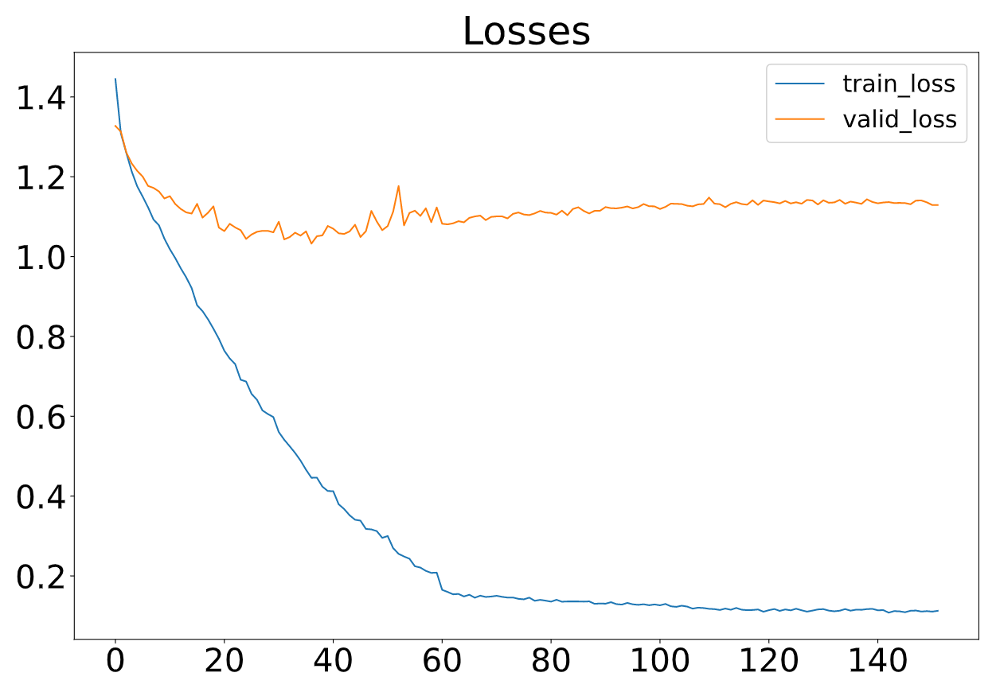
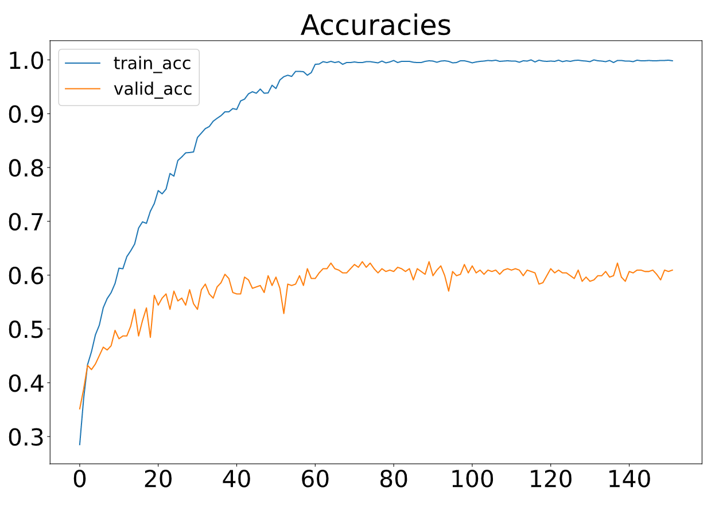
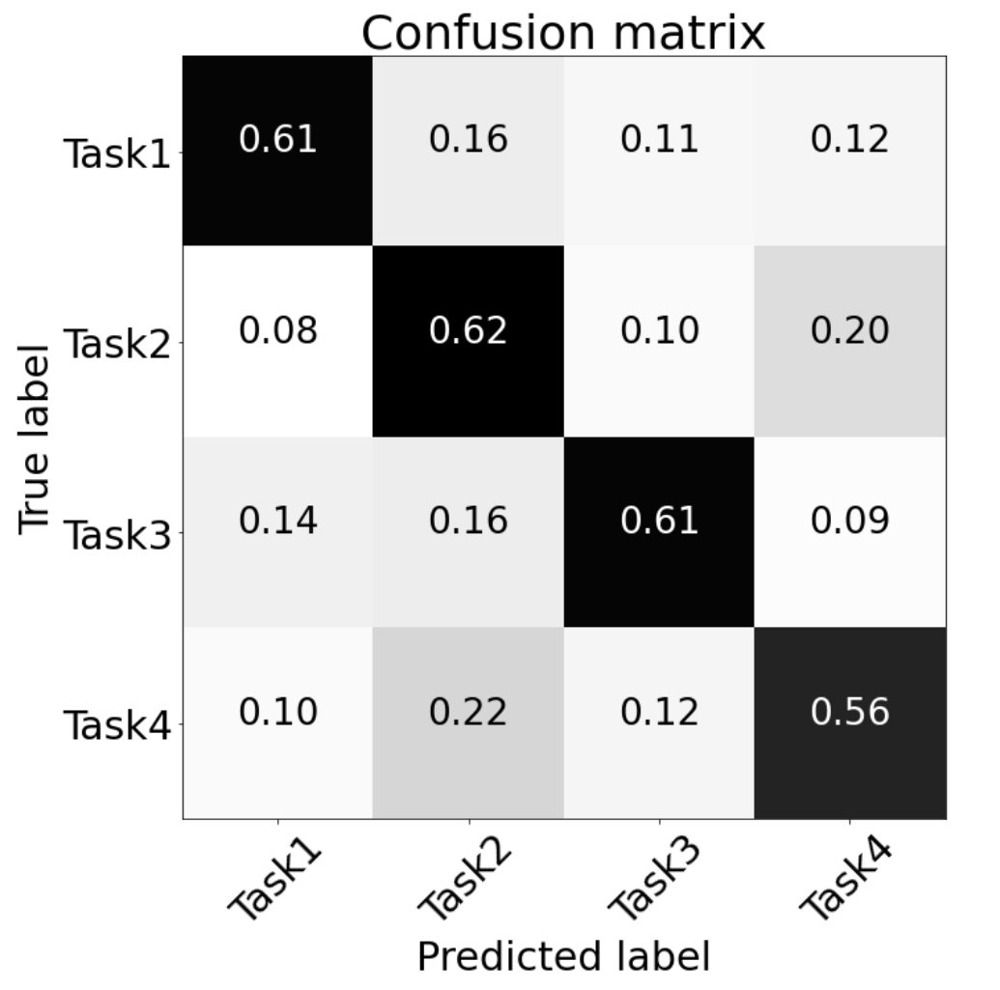
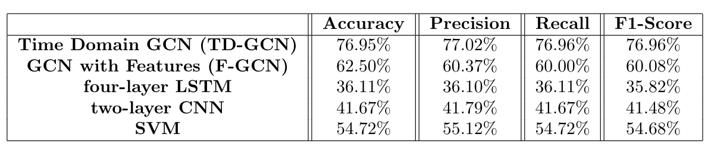

# EEG-motor-imagery
ECE-GY 9123 Project: GCN-Explain-Net: An Explainable Graph Convolutional Neural Network (GCN) for EEG-based Motor Imagery Classification and Demystification  
Qin Hu, Rory O' Keeffe

## Introduction
Biometrics such as Electroencephalography (EEG) signals have drawn substantial interest in decoding brain activities, such as classifying emotions and motor intention. Motor Imagery EEG signals have been extensively researched in support of normal daily living of disabled individuals, through the underlying neurophysiological signal patterns learned by conventional convolutional neural networks. However, often these networks do not obtain optimal prediction performance because they fail to decipher model attention, as well as to discover complete, detailed relationships among EEG signals recorded from different electrodes.

## Dataset
Dataset Name: PhysioNet EEG Motor Movement/Imagery Dataset
The EEG Motor Movement/Imagery Dataset includes 64-channel EEG signals collected at a sample rate of 160 Hz from 109 healthy subjects who performed six different tasks in the 14 experimental runs. For execution data, these tasks are (i) left fist, (ii) right fist open and closed, (iii) both fists, (iv) both feet open and closed. The imagined tasks are the same as though executed, such that we have four classes each of imaginary and executed movements.  Subjects were guided to perform tasks by visual feedback.

## Approaches
* Model 1: GCN with Time Domain Signals (TD-GCN)
* Model 2: GCN With Diverse Features (F-GCN) - extracted 25 features (temporal, spectral, and connectivity) from normalized EEG signals as feature matric of each trial, computed the adjacency matrix in Coordinate (COO) format using Spearman's correlations, and calculate the connectivity features through MS-coherence.

## Results
### Model 1

### Model 2
The proposed F-GCN model with diverse features achieves a validation accuracy of 62.50% (testaccuracy: 62.50%, a precision of 60.37%, a recall of 60.00% and a F1-score of 60.08%. The training process is efficient that the training per iteration is≈1.3s due to the small number of trainableparameters. The proposed model converges at epoch 160.    
 

## Comparative Study
The goal of the comparative study is to evaluate the performance and efficiency of GCN, relative to other models. We compare our proposed GCN models (with time-domain signals or with various features) with three commonly-used conventional models; LSTM and CNN are deep learning models, and SVM is conventional classifier.

## Conclusion
Firstly, we can conclude that GCN is well-suited to this EEG classification task, as it has better performance for than other neural networks (CNN, LSTM) with a comparable number of trainable parameters. 
An important deduction from our results relates to how the GCN naturally selects features. TD-GCN had the best accuracy, with simple time domain features. 

An important deduction from our results relates to how the GCN naturally selects features. TD-GCN had the best accuracy, with simple time domain features being fed to a high-powered GCN. On the other hand, when the features were manually selected beforehand, and fed to a more compact GCN, a comparable accuracy was obtained. This indicates that the TD-GCN is naturally selecting features in a superior way to manual feature selection. Moreover, when given manually selected features, GCN operates well; F-GCN is superior to SVM in this context, in contrast to other Deep Neural Network types. The ultimate aim of this project was to gain insights about neurophysiological mechanisms, through the classification task. Using confusion matrices in a variety of ways, allowed us to draw conclusions about neural mechanisms, during motor imagery and execution:
* The signal features associated with single limb movements are distinctive from double limb movements.
* Given that all region subsets had an accuracy significantly greater than chance, information about motor planning is present in all parts of the brain.
* Each area's feature set contributes to the overall classification accuracy. Rather than one specific area of the brain containing the discriminative information regarding different motor tasks, different components of the information are spread around the brain.
* The most discriminative components lie in the prefrontal cortex, rather than in the frontal cortex (traditionally responsible for motor planning).
* The signal features associated with imaginary data are quite distinctive from executed data.

Generally, we can conclude that GCN is well-suited to this EEG classification task, as it has better performance than other neural networks (CNN, LSTM) with a comparable number of trainable parameters. Another important deduction from our results relates to how the GCN naturally selects features. TD-GCN had the best accuracy, with simple time domain features being fed to a high-powered GCN. On the other hand, when the features were manually selected beforehand, and fed to a more compact GCN, a worse (but still respectable) accuracy was obtained. This indicates that the TD-GCN is naturally selecting features in a superior way to manual feature selection. Moreover, when given manually selected features, GCN operates relatively well; F-GCN is superior to SVM in this context, in contrast to other Deep Neural Network types. As feature selection has been an open topic and is highly depending on task definition, training an auto-encoder to extract features that optimally represent the EEG signals of each trial can be one of our future works.
